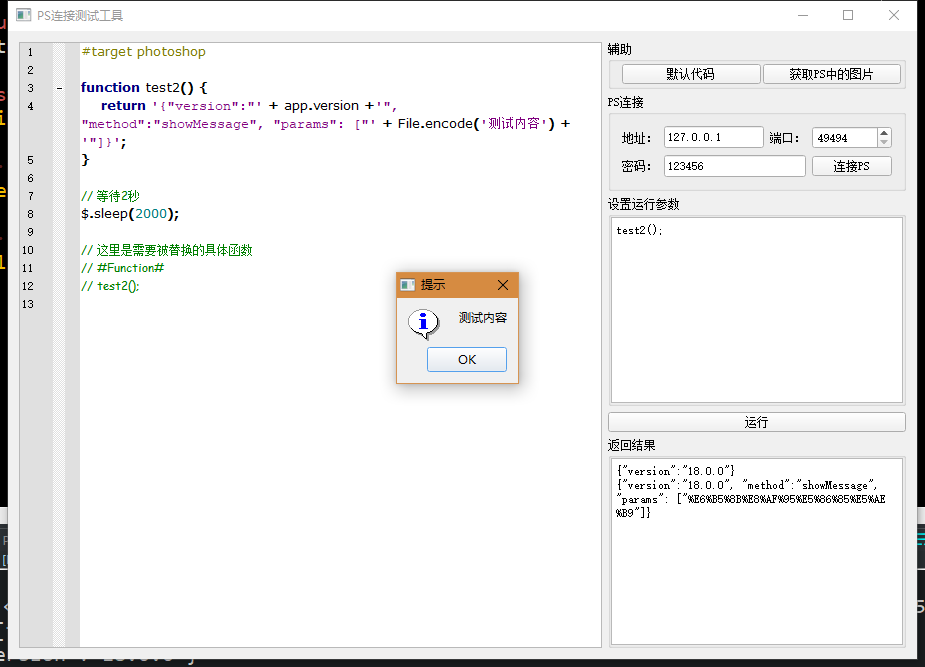

# Photoshop Socket Connect

## requirement
pycryptodomex

## first

## new version
only use QTcpSocket send data and get data

## old version
[the old version 1](Version1)

python socket test

[the old version 2](Version2)

use Photoshop.exe xx.jsx and js socket report data

[the old version 3](Version3)

use QTcpServer receive data and QTcpSocket send js data