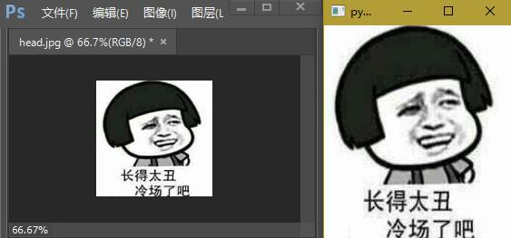
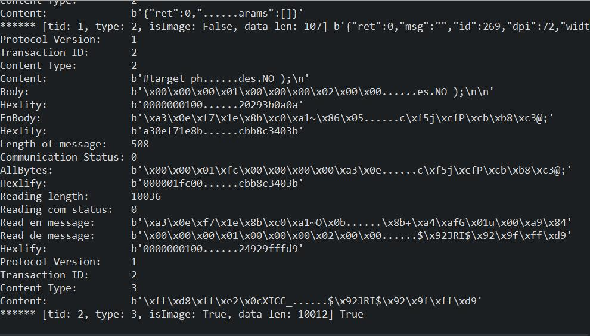

# Photoshop Socket Connect

first:


second: run Test.py




Demo code:

```python
import os

from Constant import CodeOpenImage, CodeGetImage
from Protocol import Protocol
from PsConnect import PsConnect

if __name__ == '__main__':
    # debug
    Protocol.DEBUG = True

    PsConnect.connect('127.0.0.1', 49494, '123456')
    # 获取ps版本
    msg = PsConnect.send('app.version;')
    print('******', msg, msg.data)

    # 打开图片
    msg = PsConnect.send(CodeOpenImage.format(
        os.path.abspath('head.jpg').replace('\\', '/')))
    result = msg.toDict()
    print('******', msg, msg.data, result)

    # 获取图片
    msg = PsConnect.send(CodeGetImage.format(
        result.id, result.width, result.height))
    print('******', msg, msg.isImg())

    try:
        import sys
        from PyQt5.QtWidgets import QApplication, QLabel
        from PyQt5.QtGui import QPixmap
        app = QApplication(sys.argv)
        w = QLabel()
        w.setScaledContents(True)
        w.resize(result.width, result.height)
        pixmap = QPixmap()
        # open('out.jpg', 'wb').write(msg.data)
        pixmap.loadFromData(msg.data)
        w.setPixmap(pixmap)
        w.show()
        sys.exit(app.exec_())
    except SystemExit:
        pass
    except:
        input('Press any key to exit')


```